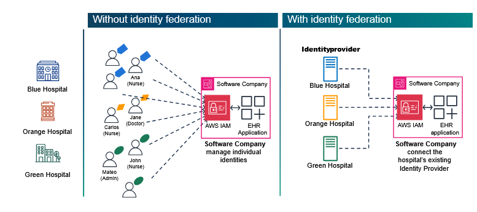
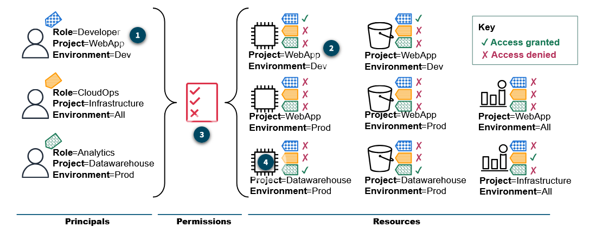

# Managing Access

[[_TOC_]]

## IAM

Identity and Access Management

IAM controls who can access what by determining **who is authenticated** (logged in) and **authorized** (has permissions) to use your resources. It also helps meet compliance requirements by providing detailed control over resource access.

>[!IMPORTANT]
>**IAM is a global service.**

## AWS Resource access process

1. authenticating the user or application.
2. authorizing access requests.
3. granting permission to perform actions on AWS resources.

## Key components of IAM

- Users  
  A person or application that interacts with AWS.
- Groups  
  A collection of IAM users with similar access needs.
- IAM Role  
  A set of persmissions that users or services can assume.
- Policies  
  A JSON document that defines permissions by allowing or denying actions on specific resources.

## Unique user types

- Root user  
  Primary account holder with full access to all resources. This user should be used minimally because of its extensive permissions.
- Federated user  
  A federated user accessess AWS resources by authenticating outside AWS through an external Identity Provider (IdP)

## IAM Policies

IAM policies are written in JSON format.  
AWS first denies any request that is explicitly denied, allows requests that are explicitly allowed, and denies everything else by default.

## Policy elements

| Element   | Description                                                                                                                      | Required |
| --------- | -------------------------------------------------------------------------------------------------------------------------------- | -------- |
| Effect    | Use Allow or Deny to indicatie whether the policy allows or denies access.                                                       | Yes      |
| Principal | Indicate the account, user, role, or federated user to which you would like to allow or deny access (only on resource policies). | No       |
| Action    | Include a list of actions that the policy allows or denies.                                                                      | Yes      |
| Resource  | Specify a list of resources to which the actions apply.                                                                          | Yes      |
| Condition | Specify the circumstances under which the policy grants permission.                                                              | No       |

### Example policy

```json
{
 "Version": "2012-10-17",
 "Statement": [
   {
     "Effect": "Allow",
     "Action": "ec2:DescribeInstances",
     "Resource": "*"
   }
 ]
}
```

## policy types

| Policy type             | Description                                                                                                                                                                                                                                                                                                                                                                                              |
| ----------------------- | -------------------------------------------------------------------------------------------------------------------------------------------------------------------------------------------------------------------------------------------------------------------------------------------------------------------------------------------------------------------------------------------------------- |
| Identity-based policies | Attach managed and inline policies to IAM identities (users, groups to which users belong, and roles).                                                                                                                                                                                                                                                                                                   |
| Resource-based policies | Attach inline policies to resources. The most common examples of resource-based policies are Amazon Simple Storage Service (Amazon S3) bucket policies and IAM role trust policies.                                                                                                                                                                                                                      |
| Organizational SCPs     | Use an AWS Organizations Service Control Policy (SCP) to define the maximum permissions for account members of an organization or organizational unit (OU).                                                                                                                                                                                                                                              |
| ACLs                    | Use access control lists (ACLs) to control which principals in other accounts can access a resource to which the ACL is attached. ACLs are similar to resource-based policies, but they are not written in JSON. Their format depends on the service (XML for Amazon S3 and rule tables for network ACLs). They are stored directly with the resource they protect rather than as separate policy files. |

## Common access patterns using roles

- Temporary elevated access
- Service-to-service access
- Cross-account access
- Federated user access
- Programmatic access

### Federated access with IAM

  
_example_

## Implementing access paterns

### Same account service-to-service communication

When services communicate within a single AWS account, IAM provides two main approaches:

- **Access control with resource policies**  
  Attach permissions directly to resources for services that support resource-based policies (such as Amazon Simple Storage Service [Amazon S3], Amazon Simple Notification Service [Amazon SNS], and AWS Lambda). Please note that you always have to specify the principal elements in a resource-based policy, to indicate who will access the resource. 
- **Access control with service role**  
  Create IAM roles with the appropriate permissions that AWS services can assume to perform actions on other AWS services.

### Cross-account service-to-service communication access with resource policies

Cross-account access requires cooperation between both accounts:

- The resource account (containing the resource to be accessed) must grant permission to the service account (containing the service that needs access).
- The service in the service account must be configured to access the cross-account resource.

## Choosing between cross-account approaches

| Cross-Account Resource Policies                         | Cross-Account Role Assumption                        |
| ------------------------------------------------------- | ---------------------------------------------------- |
| Has a simpler implementation                            | Works with all AWS services                          |
| Provides direct access without role assumption          | Has more centralized permission management           |
| Works with only services that support resource policies | Provides temporary credentials with limited lifetime |
| Is good for granting specific permissions               | Is better for complex permission scenarios           |

## IAM Best Practices

Before you begin implementing IAM in your own environments, familiarize yourselves with these recommended best practices that will help you avoid common pitfalls and strengthen your security posture from day one.

- Protect your root account.
- Create individual IAM users.
- Use groups to assign permissions.
- Follow the principle of least privilege.
- Configure strong password policies.
- Regularly rotate credentials.
- Use multi-factor authentication.
- Monitor and audit access patterns.

## Strengthening Security with MFA

With MFA users are required to provide 2 or more verification factors to gain access:

- something you know (password or pin)
- something you have (MFA device, mobile phone or hardware token)
- something you are (biometric verification)

### AWS MFA security Best practices

- Enable MFA for your AWS root user (highest priority)
- Enforce MFA for all IAM users with console access
- Implement temporary security credentials with MFA for programmatic access
- Require MFA for IAM role assumption, especially for roles with elevated privileges

### MFA Tokens

- Virtual MFA devices ( google authenticator)
- FIDO security Keys ( yubikey)
- Hardware TOTP tokens (yubikey)
- SMS text-message-based MFA

### Enforcing MFA with IAM Policies

```json
{
   "Version": "2012-10-17",
   "Statement": [
       {
           "Sid": "DenyAccessWithoutMFA",
           "Effect": "Deny",
           "Action": [
               "s3:GetObject",
               "s3:PutObject",
               "s3:ListBucket",
               "s3:DeleteObject"
           ],
           "Resource": [
               "arn:aws:s3:::classified-documents-bucket",
               "arn:aws:s3:::classified-documents-bucket/*",
               "arn:aws:s3:::confidential-data-bucket",
               "arn:aws:s3:::confidential-data-bucket/*"
           ],
           "Condition": {
               "BoolIfExists": {
                   "aws:MultiFactorAuthPresent": "false"
               }
           }
       },
       {
           "Sid": "AllowBasicS3ListingForNavigation",
           "Effect": "Allow",
           "Action": [
               "s3:ListAllMyBuckets",
               "s3:GetBucketLocation"
           ],
           "Resource": "*"
       }
   ]
}
```

### MFA for programmatic access

Although console access can be protected with MFA during login, programmatic access by using AWS CLI, SDKs, or API calls presents unique challenges:

- Access keys don't inherently support MFA verification.
- Long-running applications need secure authentication.
- Automation scripts can't prompt for MFA codes.  

You can use AWS Security Token Service (AWS STS) to request temporary credentials that enforce MFA.
Example:

```
aws sts get-session-token \
--serial-number arn:aws:iam::123456789012:mfa/username \
--token-code 123456 \
--duration-seconds 43200
```

For this command to work, the IAM user must have MFA enabled and an MFA device already associated with their account.
When this command runs, AWS STS verifies the following:

- The IAM user making the request exists.
- The MFA device specified by the serial number is associated with that user.
- The token code provided is valid for the current time window.

If verification succeeds, AWS STS returns a JSON response containing the following:

- AccessKeyId: A new temporary access key ID
- SecretAccessKey: A new temporary secret access key
- SessionToken: A token that validates the temporary credentials
- Expiration: The timestamp when these credentials will expire (in this case,12 hours later)

These temporary credentials can then be used with AWS CLI commands or API calls, and they will have the same permissions as the IAM user who requested them.

### MFA Delete

Although IAM policies and standard MFA secure access to AWS resources, some AWS services have additional MFA settings for protection against destructive operations. Amazon Simple Storage Service (Amazon S3) MFA delete is a good example.  
When enabled on an S3 bucket, MFA delete helps prevent accidental or unauthorized data loss. It requires both valid AWS credentials and a valid MFA code from an IAM registered device before changing the bucket's versioning state or permanently deleting object versions.

## IAM Identity Center for Federated Access

IAM Identity Center builds on AWS Identity and Access Management (IAM) to simplify access management to multiple AWS accounts, AWS applications, and other SAML-enabled cloud applications. In IAM Identity Center, you create or connect your workforce users for access across AWS. You can choose to manage access to only your AWS accounts, only your cloud applications, or both.

### Key use cases for IAM Identity Center

IAM Identity Center centralizes identity management and eliminates duplicate user management as your AWS environment grows. You can deploy it in two ways:

- With AWS Organizations (recommended) to manage multiple accounts
- As an account instance within a single AWS account when you need to support isolated application deployments

As a best practice, enable AWS Organizations even with only one account. Doing so provides a foundation for future growth and enables the full capabilities of IAM Identity Center.

## Advanced Access Control with Attributes and Tags

### Using tags for attribute-based access control

AWS IAM implements ABAC primarily through tags on principals and resources. ABAC dynamically controls access to AWS resources by using policy condition statements to compare principal tags with resource tags.  
These attribute-based policies reduce the need to create separate policies for each principal-resource combination, simplifying permission management at scale.  


_example of ABAC_

### Attribute-based access control patterns

Authorization patterns are standard approaches for designing IAM policy conditions that evaluate attributes to make access decisions. Common authorization patterns include the following:

- Matching same-value tags across principals and resources
- Requiring specific tag values
- Checking for tag presence
- Explicitly denying access based on tag values

AWS services support tag-based access control differently. Amazon Elastic Compute Cloud (Amazon EC2), Amazon Relational Database Service (Amazon RDS), and Amazon DynamoDB allow direct tag comparison by using aws:ResourceTag.  
Amazon Simple Storage Service (Amazon S3) requires alternative approaches, such as prefix-based permissions. Many services support resource policies that can evaluate principal tags for finer control.

### Condition keys for tag-based authorization

AWS provides two types of condition keys for use in IAM policies:

| Global                                   | Service-specific                              |
| ---------------------------------------- | --------------------------------------------- |
| Available across all AWS services        | Unique to individual AWS services             |
| **Format**: aws:{condition-name}         | **Format**: {service-prefix}:{condition-name} |
| **Example**: aws:PrincipalTag/Department | **Example**: ec2:ResourceTag/Project          |

### Key ABAC condition keys

| Condition Key               | Description                                                                                                                                                                                         | Example                                                                                                                                                                    |
| --------------------------- | --------------------------------------------------------------------------------------------------------------------------------------------------------------------------------------------------- | -------------------------------------------------------------------------------------------------------------------------------------------------------------------------- |
| aws:ResourceTag/{tag-key}   | This syntax compares a resource's tag value with a policy-specified value.                                                                                                                          | "aws:ResourceTag/Department": "Finance" checks if the resource has the Department tag with value Finance.                                                                  |
| aws:PrincipalTag/{tag-key}  | This syntax compares the requesting principal's tag value with a policy-specified value.                                                                                                            | "aws:PrincipalTag/Department": "Finance" checks if the requesting user or role has the Department tag with value Finance.                                                  |
| aws:RequestTag/{tag-key}    | This syntax verifies tag values in API requests that create or modify resources.                                                                                                                    | "aws:RequestTag/Environment": "Production" requires API requests that include the Environment tag with value Production.                                                   |
| ${aws:PrincipalTag/tag-key} | This syntax represents a policy variable. Unlike the condition keys that compare against a fixed value, this variable dynamically references the value of a specific tag attached to the principal. | "arn:aws:s3:::amzn-s3-demo-bucket/${aws:PrincipalTag/team}/*" creates a dynamic path within the S3 bucket amzn-s3-demo-bucket based on the IAM principal's team tag value. |

Example:

```json
"Condition": {
 "StringEquals": {
   "aws:ResourceTag/Project": "${aws:PrincipalTag/Project}"
 }
}
```
>[!Note]
>Not all AWS services support the aws:ResourceTag condition key, and most use service-specific keys. Check AWS documentation for service-specific support for authorization based on tags.

### Implementing ABAC by using tags

1. Plan your tagging strategy
2. Apply tags to resources
3. Apply tags to IAM principals
4. Create policies with tag conditions

#### Example 1: Project based Amazon EC2 access control

An example is Amazon EC2 instance management permissions for only resources with matching Project tags.

```json
{
 "Version": "2012-10-17",
 "Statement": [
 {
  "Effect": "Allow",
  "Action": [
    "ec2:StartInstances",
    "ec2:StopInstances"
  ],
  "Resource": "*",
  "Condition": {
    "StringEquals": {
      "aws:ResourceTag/Project": "${aws:PrincipalTag/Project}"
    }
  }
 },
 {
  "Effect": "Allow",
  "Action": "ec2:DescribeInstances",
  "Resource": "*"
 }
 ]
}
```

#### Example 2: Departement-based Amazon S3 access control

Users can access S3 buckets named after their department (for example,  department-Finance).

```json
{
 "Version": "2012-10-17",
 "Statement": [
 {
 "Effect": "Allow",
 "Action": [
  "s3:GetObject",
  "s3:PutObject"
 ],
 "Resource": [
  "arn:aws:s3:::department-${aws:PrincipalTag/Department}/*"
 ]
 },
 {
 "Effect": "Allow",
 "Action": "s3:ListBucket",
 "Resource": "arn:aws:s3:::department-${aws:PrincipalTag/Department}"
 },
 {
 "Effect": "Allow",
 "Action": "s3:ListAllMyBuckets",
 "Resource": "*"
 }
 ]
}
```

### Best Practices for ABAC

- Enforce tag constistency
- Implement tag enforcement
- Secure your tags
- Test your policies
- Understand service-specific ABAC limitations
