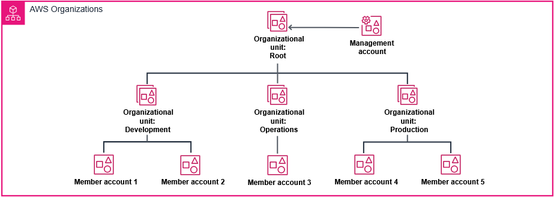

# AWS Organizations

[[TOC]]

## Intro

**Multi-account solutions** refers to the strategy of using multiple AWS accounts to isolate different workloads, environments, or teams.  
A common example of this is provisioning separate accounts for development, testing, and production. By isolating these environments in different accounts, you can minimize the risk of production impacts while maintaining consistent policies across all accounts.

As you can imagine, managing multiple accounts at enterprise scale can get complex. This is where AWS Organizations is helpful. AWS Organizations is a service that helps you centrally manage and govern multiple AWS accounts at scale.  
Think of it as your command center for maintaining multiple AWS accounts.

For example, imagine you're managing a large enterprise with different departments. By using AWS Organizations, you can create organizational units, or OUs. You create an OU for each department—for example, finance, HR, and engineering. Each OU can have its own set of policies and permissions while maintaining centralized billing and security controls, and each account in the OU will inherit these controls.

Having separate sets of policies and permissions is important because security and governance are paramount in cloud operations. By using AWS Organizations, you can apply **service control policies**, or **SCPs**. An SCP is <u> a guardrail that enforces security policies across your accounts</u>, helping you maintain compliance with security standards and prevent unauthorized actions. For instance, you can restrict specific AWS services in development accounts or enforce encryption requirements, such as mandatory encryption for S3 buckets, across all accounts. These restrictions will apply to all identities in your member accounts no matter what they configure in IAM.

The benefits of a multi-account strategy managed by AWS Organizations are substantial. You'll see improved security through account segregation, better cost management through consolidated billing, and enhanced operational efficiency through centralized management.

However, there are challenges to consider. The initial setup requires careful planning of your organization structure. You'll need to think about account limits, service quotas, and how to handle shared resources. Migrating existing accounts into AWS Organizations can also be complex.

## Working with AWS Organizations


_Example of dividing organzations in OU's_

| Service                                  | Purpose                                     | Key Feature                                                                       |
| ---------------------------------------- | ------------------------------------------- | --------------------------------------------------------------------------------- |
| AWS Organizations                        | Central management of multiple AWS accounts | Account management, SCP administration, and consolidated billing                  |
| AWS Identity and Access Management (IAM) | Fine-grained access control                 | Roles, IAM policies, users, and groups                                            |
| AWS IAM Identity Center                  | Centralized access management               | Single sign-on, permission sets, and external Identity provider (IdP) integration |

### Implementation Guidance

Companies should focus on three core services:

1. AWS organisations
2. IAM
3. IAM Identity Center

### Creating SCP's

SCPs use a syntax like IAM permission policies and resource-based policies such as S3 bucket policies. An SCP is a plain text JSON file.

## AWS Organization Policy types

- Authorization policy
- Management policy

### Authorization policies

Authorization policies maintain security controls for multiple AWS accounts from a single management point in an organization. Review the following information to learn more about authorization policies.

#### Service Control Policy (SCP)

- An SCP is a management tool providing centralized authority over what IAM users and roles are allowed to do within an organization's structure.
- SCPs can restrict which AWS services are accessible, limit access to specific resources, and define particular circumstances for requests.

#### Resource Control Policy (RCP)

- An RCP is a mechanism that organizations can use to centrally manage and limit the maximum allowable permissions for resources.
- RCPs are used to limit resource access to only those identities within an organization. Additionally, RCPs define specific circumstances under which external identities are permitted to interact with an organization's resources.

### Management policies

Management policies provide a centralized approach to configuring and administering AWS services and their functionalities across an entire organization.

| Policy              | Description                                                                                                                                                                                                                           |
| ------------------- | ------------------------------------------------------------------------------------------------------------------------------------------------------------------------------------------------------------------------------------- |
| Declarative         | Declarative policies help specify and maintain the desired configurations for AWS services on a large scale throughout an organization. These configurations remain consistent even as the service evolves with new features or APIs. |
| Backup              | Backup policies offer a centralized method to implement and oversee backup strategies for AWS resources across multiple accounts within an organization.                                                                              |
| Tag                 | Tag policies facilitate the standardization of tags applied to AWS resources across various accounts in an organization.                                                                                                              |
| Chat application    | Chat application policies regulate access to an organization's accounts from messaging platforms such as Slack and Microsoft Teams.                                                                                                   |
| AI services opt-out | AI services opt-out policies help organizations manage data collection settings for AWS AI services across all accounts under their purview.                                                                                          |

### Tagging Policies

Tag policies in AWS Organizations are a feature that helps standardize and enforce consistent tagging across AWS accounts. They help define rules for tags, including required tags, allowed values, and tag formats. This helps maintain organized resource management, cost allocation, and compliance across an organization.

- Enforcing consistent tagging standards
- Improving resource organization
- Improving cost tracking and allocation
- Simplifying compliance management

### Enforcing tag policies

Tag policies help maintain consistent tagging across resources in member accounts within an organization.

>[!caution]
>Be cautious with AWS services that feature automatic resource creation within resource groups. For instance, tags can automatically transfer from Auto Scaling groups and Amazon EMR clusters to associated EC2 instances. If Amazon EC2 tag policies are more restrictive than those for the parent services (such as Amazon EC2 Auto Scaling or Amazon EMR), enabling strict enforcement could prevent proper tagging. This can disrupt essential functions such as dynamic scaling and resource provisioning.

>[!note]
>@@assign is an inheritance operator defining how tag values are inherited by child accounts and OUs. It specifies the tag key, value, and the resources where the policy is enforced.

Example:  

```json
{
  "tags": { //Root element defining tag policies
    "Environment": { //First tag policy name "Environment"
      "tag_key": { //Defines the key for the Environment tag
        "@@assign": "Environment" //Assigns "Environment" as tag key
      },
        "tag_value": { //Defines allowed values for Environment tag
          "@@assign": [ //List of permitted values
            "Production",
            "Development",
            "Testing",
            "Staging"
          ]
  },
    "enforced_for": { //Specifies resources where tag is enforced
    "@@assign": [ //List of resource types
      "ec2:instance",
      "s3:bucket"
      ]
    }
  },
    "CostCenter": { //Second tag policy named "CostCenter"
      "tag_key": { //Defines key for the CostCenter tag
        "@@assign": "CostCenter" //Assigns "CostCenter" as tag key
      },
      "tag_value": { //Defines allowed values for CostCenter tag
        "@@assign": [ //List of permitted values
          "IT",
          "Marketing",
          "Sales",
          "HR"
        ]
      }
    }
  }
}
```

### When to centralize and when to keep local

| Centralize in Organizations               | Keep in AWS Accounts                   | Use IAM Identity Center                           |
| ----------------------------------------- | -------------------------------------- | ------------------------------------------------- |
| Cross-account access patterns             | Account-specific service roles         | For all human user access                         |
| Organization-wide governance requirements | Emergency ("break-glass") access roles | For role-based access across accounts             |
| SCPs requiring consistent enforcement     | Specialized workload permissions       | For integration with corporate identity providers |

>[!note]
>IAM Identity Center is specifically designed for managing human access across an AWS environment. For non-human identities (applications, services, and automation), IAM roles remain the recommended approach.


